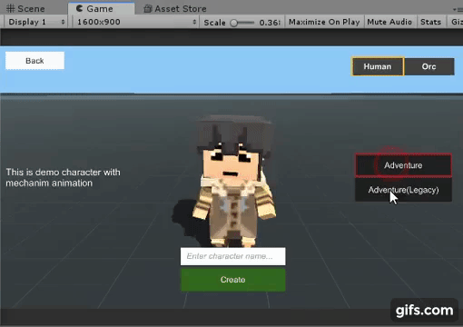
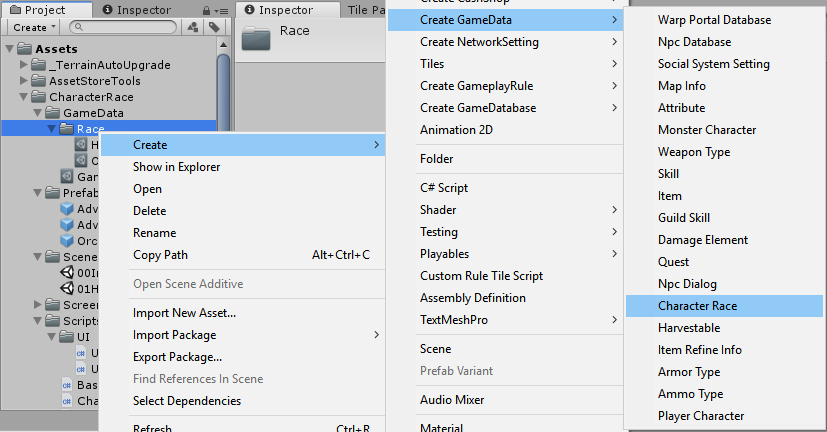
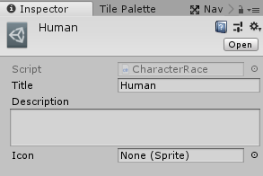
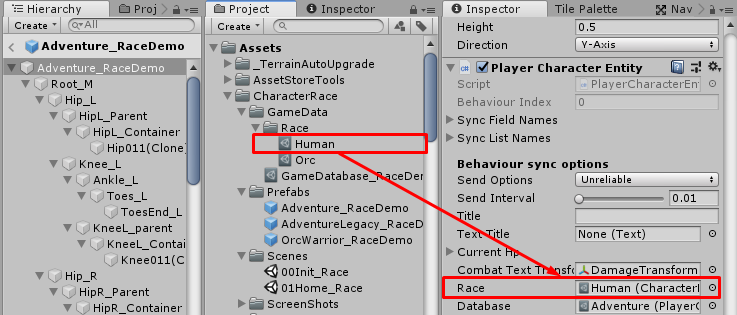
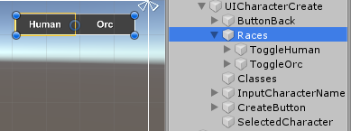
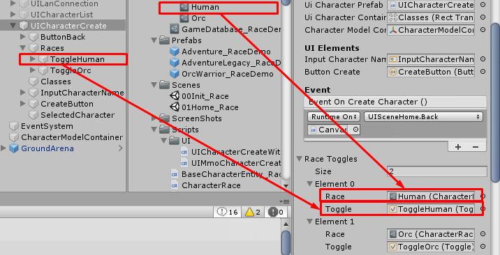

# UnityMultiplayerARPG_CharacterRace

Try the demo in `/Scenes`

## How to use

- Create `Character Race` by right click in `Project` view then select 

- Set its data

- Set it to your player character entity

## UI Customization

- At Character Create UI, change `UI Character Create` component to `UI Character Create With Race` component

- Prepare `Toggle` and `Toggle Group` UIs, they will be used to toggle races

- Add `Character Race` data and `Toggle` UIs to `UI Character Create With Race` component

